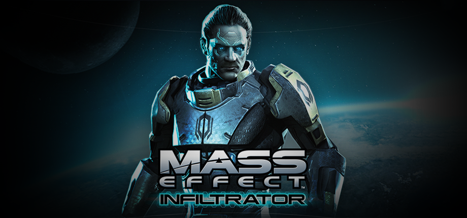

<h1 align="center">
<br>
MASS EFFECT™ INFILTRATOR · PSVita Port
</h1>
<p align="center">
  <a href="#setup-instructions-for-players">How to install</a> •
  <a href="#controls">Controls</a> •
  <a href="#known-issues">Known Issues</a> •
  <a href="#build-instructions-for-developers">How to compile</a> •
  <a href="#credits">Credits</a> •
  <a href="#license">License</a>
</p>

Mass Effect: Infiltrator is an iOS/Android-exclusive Third-Person Shooter with
RPG Elements released as a tie-in game to Mass Effect 3. The players take
control of Randall Ezno, a Cerberus Operative that ends up at odds with
Cerberus's plans for himself and his coworkers. Much shooting and
backstabbery ensues.

This repository contains a loader of **the Android release of Mass Effect:
Infiltrator**, based on the [Android SO Loader by TheFloW][gtasa_vita].
The loader provides a tailored, minimalistic Android-like environment to run
the official ARMv6 game executable on the PS Vita.

Disclaimer
----------------

**MASS EFFECT™ INFILTRATOR is copyright © 2012 EA International (Studio and
Publishing) Ltd.**

Mass Effect, Mass Effect logo, BioWare and BioWare logo are trademarks of
EA International (Studio and Publishing) Ltd. EA and the EA logo are trademarks
of Electronic Arts Inc. Developed by Iron Monkey Studios.

The work presented in this repository is not "official" or produced or
sanctioned by the owner(s) of the aforementioned trademark(s) or any other
registered trademark mentioned in this repository.

This software does not contain the original code, executables, assets, or
other non-redistributable parts of the original game product. The authors of 
this work do not promote or condone piracy in any way. To launch and play
the game on their PS Vita device, users must possess their own legally obtained
copy of the game in form of an .apk file.

Setup Instructions (For Players)
----------------

In order to properly install the game, you'll have to follow these steps
precisely:

- Install [kubridge][kubridge] and [FdFix][fdfix] by copying `kubridge.skprx`
and `fd_fix.skprx` to your taiHEN plugins folder (usually `ur0:tai`) and adding
two entries to your `config.txt` under `*KERNEL`:

```
  *KERNEL
  ur0:tai/kubridge.skprx
  ur0:tai/fd_fix.skprx
```

> ⚠️ Don't install `fd_fix.skprx` if you're using the rePatch plugin!

> ⚠️ Unlike the Dead Space Mobile port, there is no requirement for
`kubridge.skprx` version. Any version should work.

- Make sure you have `libshacccg.suprx` in the `ur0:/data/` folder on your
console. If you don't, use [ShaRKBR33D][shrkbrd] to get it quickly and easily.

- <u>Legally</u> obtain your copy of Mass Effect: Infiltrator in a form
of an `.apk` file. Make sure that your game is **v1.0.58**.

    - If you have it installed on your phone, you can 
        [get all the required files directly from it][unpack-on-phone]
        or by using any APK extractor you can find on Google Play.

> ℹ️ Verify that your build is exactly the correct one using **sha1sum** (can also
> be found as an online tool). sha1sum for `lib/armeabi/libMassEffect.so`
> must be `ea58b733d3d267ab639431b50539542faa43f0d0`

- Open the `.apk` with any zip explorer (like [7-Zip](https://www.7-zip.org/))
and extract all folders from the `.apk` into `ux0:data/masseffect` on your Vita.
Example of correct resulting path: `ux0:data/masseffect/lib/armeabi/libMassEffect.so`

- If your `.apk` was less than 100MB of size, you also need assets ("cache").
You need to run the game at least once on your device so that it downloads the
required files, and then you can find them at `/sdcard/Android/data/com.ea.games.meinfiltrator_gamepad/`.
Copy all files and folders from there to `ux0:data/masseffect/assets/` on your Vita.
Example of correct resulting path: `ux0:data/masseffect/assets/AssetInfo.indicate`,
`ux0:data/masseffect/assets/published/data/healths.prefabs.sb`

- Install `MassEffectInfiltrator.vpk` (from [Releases][releases]).

- **Optional but strongly recommended**: Install [PSVshell][PSVshell]
to overclock your device to 500Mhz.

- Don't forget that the port has a configurator/companion app you can launch
form live area by clicking on "Settings" in the bottom left corner.

Controls
-----------------

|       Button        | Action                             |
|:-------------------:|:-----------------------------------|
| ![joysl] / ![joysr] | Move / Control camera              |
| ![trigl] / ![trigr] | Aim☀ / Fire                        |
|      ![dpadh]       | Ability Selector / Weapon Selector |
|      ![dpadv]       | Next / Previous Ability / Weapon   |
|      ![cross]       | Interact / Confirm (in menu)       |
|      ![circl]       | Melee Atack / Back (in menu)       |
|      ![squar]       | Stealth / Cloak                    |
|      ![trian]       | Ability Activation                 |
|      ![start]       | Open Menu                          |

☀ — Note that Aim (![trigl]) is not hold-to-aim. You click once to activate
aim mode, and once again to deactivate it.

Known Issues
----------------

1. After you die or quit to menu and resume game, you may see the long loading
screen telling you that you should wait for about 40 seconds. This is
a side effect of fixing another, game-breaking bug, and most likely can not be
helped.
2. In intensive combat scenes, framerate can degrade to ~20 FPS. I'll try to
figure out ways to make it better in the next versions.
3. Aiming with sniper rifle can get very stuttery. I'll try to figure out ways
to make it better in the next versions.
4. Help menu and exit game button in main menu don't work. Most likely, won't
be fixed
5. Sometimes game can start with no sound. Just close it and start again.

Build Instructions (For Developers)
----------------

In order to build the loader, you'll need a [vitasdk](https://github.com/vitasdk)
build fully compiled with softfp usage. The easiest way to obtain one is
following the instructions on https://vitasdk.org/ while replacing the URL in
this command:
```bash
git clone https://github.com/vitasdk/vdpm
```
Like this:
```bash
git clone https://github.com/vitasdk-softfp/vdpm
```

All the required libraries should get installed automatically if you follow the
installation process from https://vitasdk.org/.

After all these requirements are met, you can compile the loader with the
following commands:

```bash
cmake -Bbuild .
cmake --build build
```

Also note that this CMakeLists has two "convenience targets". While developing,
I highly recommed using them, like this:
```bash
cmake --build build --target send # Build, upload eboot.bin and run (requires vitacompanion)
cmake --build build --target dump # Fetch latest coredump and parse
```

For more information and build options, read the [CMakeLists.txt](CMakeLists.txt).

Credits
----------------

- [Andy "The FloW" Nguyen][flow] for the original .so loader.
- [Rinnegatamante][rinne] for VitaGL and lots of help with understanding and
debugging the loader and translating shaders.
- [CatoTheYounger][cato] for **tremendous** amount of testing. Not the hero we
deserved, but the one we need.
- [Once13One][o13o] for his beautiful LiveArea assets.
- Andiweli, mmtechnodrone,  SoulEaterGames: backers of the [bounty][bounty] for
this port.

License
----------------

This software may be modified and distributed under the terms of
the MIT license. See the [LICENSE](LICENSE) file for details.

[cross]: https://raw.githubusercontent.com/v-atamanenko/sdl2sand/master/img/cross.svg "Cross"
[circl]: https://raw.githubusercontent.com/v-atamanenko/sdl2sand/master/img/circle.svg "Circle"
[squar]: https://raw.githubusercontent.com/v-atamanenko/sdl2sand/master/img/square.svg "Square"
[trian]: https://raw.githubusercontent.com/v-atamanenko/sdl2sand/master/img/triangle.svg "Triangle"
[joysl]: https://raw.githubusercontent.com/v-atamanenko/sdl2sand/master/img/joystick-left.svg "Left Joystick"
[joysr]: https://raw.githubusercontent.com/v-atamanenko/sdl2sand/master/img/joystick-right.svg "Left Joystick"
[dpadh]: https://raw.githubusercontent.com/v-atamanenko/sdl2sand/master/img/dpad-left-right.svg "D-Pad Left/Right"
[dpadv]: https://raw.githubusercontent.com/v-atamanenko/sdl2sand/master/img/dpad-top-down.svg "D-Pad Up/Down"
[selec]: https://raw.githubusercontent.com/v-atamanenko/sdl2sand/master/img/dpad-select.svg "Select"
[start]: https://raw.githubusercontent.com/v-atamanenko/sdl2sand/master/img/dpad-start.svg "Start"
[trigl]: https://raw.githubusercontent.com/v-atamanenko/sdl2sand/master/img/trigger-left.svg "Left Trigger"
[trigr]: https://raw.githubusercontent.com/v-atamanenko/sdl2sand/master/img/trigger-right.svg "Right Trigger"

[kubridge]: https://github.com/bythos14/kubridge/releases/
[fdfix]: https://github.com/TheOfficialFloW/FdFix/releases/
[unpack-on-phone]: https://stackoverflow.com/questions/11012976/how-do-i-get-the-apk-of-an-installed-app-without-root-access
[shrkbrd]: https://github.com/Rinnegatamante/ShaRKBR33D/releases/
[gtasa_vita]: https://github.com/TheOfficialFloW/gtasa_vita
[releases]: https://github.com/v-atamanenko/masseffect-vita/releases/latest
[PSVshell]: https://github.com/Electry/PSVshell/releases

[flow]: https://github.com/TheOfficialFloW/
[rinne]: https://github.com/Rinnegatamante/
[cato]: https://github.com/CatoTheYounger97/
[o13o]: https://github.com/once13one/
[bounty]: https://app.bountysource.com/issues/113094798-android-port-mass-effect-infiltrator
